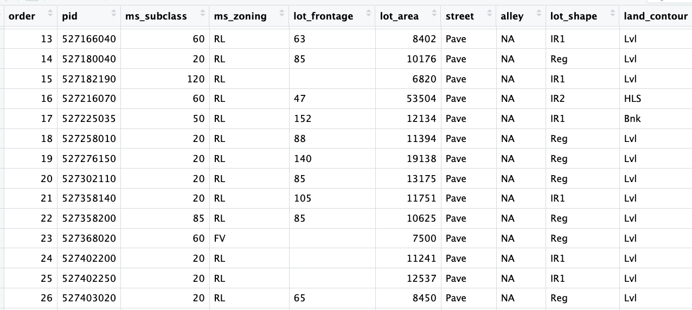

```{python}
#--package load--
import numpy as np
import pandas as pd
import seaborn as sns
import matplotlib.pyplot as plt

from sklearn import model_selection as ms
from sklearn import preprocessing as pp
from sklearn import compose
from sklearn import pipeline
from sklearn import linear_model
from sklearn import tree
from sklearn import ensemble
from sklearn import metrics
```

# **Overview**

You have been given a dataset consisting of a single file, `AmesHousing.csv`,
and a data dictionary `data-description.txt`. This dataset contains the sales
price of each home as well as other attributes of the home and the sales
transaction, such as the lot size, the square footage of each floor, when the
home was built and remodeled, whether the kitchen is upgraded, etc. A data
dictionary has been included with the data. During this lab, you will practice
using different types of regression tree methods to predict housing prices in
the data.

This dataset is a model dataset for demonstrating machine learning techniques
and for prediction. This dataset was downloaded from
[kaggle](https://www.kaggle.com/competitions/home-data-for-ml-course/data),
which holds periodic introductory competitions using this data, if you ever
wanted to try your hand at kaggle competitions you could use this assignment to
create your first entry. The dataset was originally compiled by De Cook for
educational purposes. Skim this article for some tips on using this dataset: [De
Cock 2011](https://jse.amstat.org/v19n3/decock.pdf). De Cook makes some
suggestions for simplifying the data that you can take if you need to.

The dataset and data dictionary are available here:

-   [AmesHousing.csv](https://github.com/georgehagstrom/DATA622Spring2026/blob/main/website/assignments/labs/labData/AmesHousing.csv)

-   [data-description.txt](https://jse.amstat.org/v19n3/decock/DataDocumentation.txt)

> Note: There is a lot of freedom in this exercise in terms of which variables
> you pick, some of the model choices, and also some hyperparameters. I have an
> expectation for what the answers will be in general, but you might get
> different answers depending on what you select and random chance. Report what
> you find, not what you expect to see (though if you see something unexpected
> it is a good hint to look for a mistake).

```{python}
#-- Data Import-- Keeping the recordered NA--
ames= pd.read_csv("https://raw.githubusercontent.com/georgehagstrom/DATA622Spring2026/refs/heads/main/website/assignments/labs/labData/AmesHousing.csv", keep_default_na= False)
```

```{python}
ames.columns=(ames.columns.str.strip().str.lower().str.replace(" ", "_").str.strip())
```

```{python}
#| echo: true
#| eval: false
ames.dtypes
```

Although the NA values were preserved on import, there are blank observations in
the data that were actually missing and not recorded.

{fig-align="center"}

The assignment introduction explains there are [**almost**]{.underline} no real
missing data. This is because the NA in the dataset are not identifying
missing-ness, they mean a lack of a feature. Here NA means "None".

```{python}
#| layout-ncol: 2
ames.isna().sum().sort_values(ascending=False).head(20).to_frame("NA").rename_axis("feature")
(ames == "").sum().sort_values(ascending=False).head(20).to_frame("Blanks").rename_axis("feature")
```

However, we also see that some of the variables were not imported with their
appropriate data type. There are numerical datapoints that are literal blanks
`" "`. Fixing the column types automatically change these to `NaN`, which will
then be imputed.

```{python}
#-- Data type fix for numerical--
tonum= ["lot_frontage","mas_vnr_area", "bsmtfin_sf_1", "bsmtfin_sf_2", "bsmt_unf_sf", "total_bsmt_sf", "bsmt_full_bath", "bsmt_half_bath", "garage_yr_blt", "garage_cars", "garage_area"]

for col in tonum:
  ames[col]= pd.to_numeric(ames[col], errors="coerce")
  ames[col]= (ames.groupby(["neighborhood"])[col].transform(lambda x: x.fillna(x.median())))
  ames["lot_frontage"]= ames["lot_frontage"].fillna(ames["lot_frontage"].median())

#-- Categorical Imputation with modes--
cat_modes= ["mas_vnr_type", "bsmt_exposure", "garage_finish", "bsmtfin_type_2","electrical", "bsmtfin_type_1", "bsmt_cond", "bsmt_qual", "garage_qual", "garage_cond"]

for col in cat_modes:
#-- to avoid filling all NA--
  blank_mask= ames[col].astype(str).str.strip().eq("")
  ames.loc[blank_mask, col]= np.nan
  mode_val= ames[col].mode(dropna=True)[0]
  ames.loc[blank_mask, col]= mode_val
```

Imputing by the median is most appropriate for the numerical variables. Their
distribution is skewed and using the mean would be less accurate, favoring the
skew tails. The imputation will to take into account the corresponding
neighborhood of the houses (in consideration of the nuances between
neighborhoods).

The categorical blank rows were identified, modified to NaN and then imputed
using the mode which is more appropriate for categorical.

Example of skew:

```{python}
#| eval: true
#| echo: false
print(f"The skewness value of `lot_frontage` is: {ames['lot_frontage'].skew():.3f}")
```

The identifier variables will be dropped because theyre not needed.

```{python}

#-- variable removal--
identifiers= ["pid", "order"]
ames= ames.drop(columns= identifiers)
```

Finally, before going any further, outliers as specified by De Cock will be
removed.

> I would recommend removing any houses with more than 4000 square feet from the
> data set (which eliminates these 5 unusual observations) before assigning it
> to students.

```{python}
ames= ames[ames["gr_liv_area"] < 4000]
```

--------------------------------------------------------------------------------

## **Problem 1: Building up to a Baseline Model**

### **Basic EDA and Feature Selection:**

Divide the data into an initial training and testing split. Perform a
log-transform on the sales price, this will be the target variable. Perform a
basic EDA to select features for your model. Report a summary of the EDA and the
selection of variables for your model.

> (Hint: the quality variables are important, and your intuition about what is
> important in housing is useful for picking)

Pick more than 10 variables but less than all 80 (before one-hot encoding).
Several variables encode the absence of a feature (such as no pool, no garage,
etc) as ‘NA’. This dataset has **almost** no real missing data- make sure to
encode and interpret ‘NA’ values appropriately for the variables you select.
Make sure ordered categorical features have an integer or ordinal encoding, and
use one-hot encoding on remaining categorical features.

#### Variable evaluation:

Organizing variables in a dataset such as this makes evaluating them a little
easier.

```{python}

#-- Nominal Variables-- 
nominal= ["ms_subclass", "ms_zoning", "street", "alley", "land_contour", "lot_config", "neighborhood", "condition_1", "condition_2", "bldg_type", "house_style", "roof_style", "roof_matl", "exterior_1st", "exterior_2nd", "mas_vnr_type", "foundation", "heating", "central_air", "garage_type", "misc_feature", "sale_type", "sale_condition"]

#-- Ordinal Variables--
ordinal= ["lot_shape", "utilities", "land_slope", "overall_qual", "overall_cond", "exter_qual", "exter_cond", "bsmt_qual", "bsmt_cond", "bsmt_exposure", "bsmtfin_type_1", "bsmtfin_type_2", "heating_qc", "electrical", "kitchen_qual", "functional", "fireplace_qu", "garage_finish", "garage_qual", "garage_cond", "paved_drive", "pool_qc", "fence"]

#-- Discrete Variables--
discrete= ["bsmt_full_bath", "bsmt_half_bath", "full_bath", "half_bath", "bedroom_abvgr", "kitchen_abvgr", "totrms_abvgrd", "fireplaces", "garage_cars"]

#-- Continuous Variables--
continuous= ["lot_frontage", "lot_area", "mas_vnr_area", "bsmtfin_sf_1", "bsmtfin_sf_2", "bsmt_unf_sf", "total_bsmt_sf", "1st_flr_sf", "2nd_flr_sf", "low_qual_fin_sf", "garage_area", "wood_deck_sf", "open_porch_sf", "enclosed_porch", "3ssn_porch", "screen_porch", "pool_area", "misc_val"]

#-- Time Variables--
time= ["year_built", "year_remod/add", "garage_yr_blt", "mo_sold", "yr_sold"]
```

#### Nominal

Nominal variables, because they are categorical but unorganized, are best in
one-hot encoding for linear models. The ideal candidates won't have high
cardinality, which I'd arbitrarily say is \>20 variations, considering this
dataset is only composed of 2,930 rows.

```{python}
pd.DataFrame(ames[nominal].nunique(dropna=False).sort_values(ascending= True).to_frame("unique").rename_axis("variable"))
```

`sale_condition` may be said to be downstream, but it will be kept because I
don't believe it will cause data leakage. Variables with two classes such as
`street` and `central_air` should be recoded as binary. These are also the only
variables in the entire data set to qualify in its raw state.

`exterior_1st`, `ms_subclass`, `exterior_2nd` are near the cutoff;
`neighborhood` is above that cutoff. Predictor variables that have little
variation in the classes they contain will probably not be useful for a model.
Below is a visualization of the denominations within each variable:

```{python}
#| layout-ncol: 4
#-- Assesing Variation in Categories-- 
midliner= ["#8698F3","#A7CE5B", "#95B3EE", "#D5D1C9", "#D0B8F1", "#FF767F"]
sns.set_palette(midliner)
sns.set_theme(style="white", palette= midliner)

for col in nominal:
    plt.figure(figsize=(8,4))
    sns.countplot(data=ames, x=col)
    plt.title(col)
    plt.xticks(rotation=45)
    plt.show()
```

While rare categories can matter, sparse classes like what's seen here likely
contribute a negligible amount on the predictive power of a model or may just
add noise. Variables like `roof_matl`, `condition_2`, are candidates for
removal. These should not have predictive power and could just introduce noise.

```{python}
ames= ames.drop(columns= ["roof_matl", "condition_2"])
```

### Ordinal, Discrete, Continuous

The ordinal variables are ordered categories and work well with trees and its
splits. In the case of housing, these are likely to have predictive information
about price. Below, in the boxplot of `overall_qual` there is an observable hike
in sale price. This variable is likely to have some predictive power.

```{python}
#| layout-ncol: 4
for col in ordinal:
    plt.figure(figsize=(8,4))
    sns.boxplot(data=ames, x=col, y= "saleprice")
    plt.title(col)
    plt.show()
```

The ordinal values must be mapped.

For the rest of the variables with blanks that do already have an NA category.

```{python}
#| code-fold: true
#| code-summary: "Mapping the ordinal variables"
#-- Mappings--
quality5_m= {"NA": 0, "Po": 1, "Fa": 2, "TA": 3, "Gd": 4, "Ex": 5}

lot_shape_m= {"IR3": 0, "IR2": 1, "IR1": 2, "Reg": 3}

utilities_m= {"NoSeWa": 0, "NoSewr": 1, "AllPub": 2}

land_slope_m= {"Sev": 0, "Mod": 1, "Gtl": 2}

bsmt_exposure_m= {"NA": 0, "No": 1, "Mn": 2, "Av": 3, "Gd": 4}

bsmtfin_m= {"NA": 0, "Unf": 1, "LwQ": 2, "Rec": 3, "BLQ": 4, "ALQ": 5, "GLQ": 6}

electrical_m= {"Mix": 1, "FuseP": 2, "FuseF": 3, "FuseA": 4, "SBrkr": 5}

functional_m= {"Sal": 0, "Sev": 1, "Maj2": 2, "Maj1": 3, "Mod": 4, "Min2": 5, "Min1": 6, "Typ": 7}

garage_finish_m= {"NA": 0, "Unf": 1, "RFn": 2, "Fin": 3}

paved_drive_m= {"N": 0, "P": 1, "Y": 2}

fence_m= {"NA": 0, "MnWw": 1, "GdWo": 2, "MnPrv": 3, "GdPrv": 4}


mapping_dict= {"lot_shape": lot_shape_m,
"utilities": utilities_m, "land_slope": land_slope_m, "bsmt_exposure": bsmt_exposure_m, "bsmtfin_type_1": bsmtfin_m, "bsmtfin_type_2": bsmtfin_m, "electrical": electrical_m, "functional": functional_m, "garage_finish": garage_finish_m, "paved_drive": paved_drive_m, "fence": fence_m}

for col, mapping in mapping_dict.items():
    ames[col]= ames[col].map(mapping)

quality_v= ["exter_qual", "exter_cond", "bsmt_qual", "bsmt_cond", "heating_qc", "kitchen_qual", "fireplace_qu", "garage_qual", "garage_cond", "pool_qc"]

for col in quality_v:
    ames[col]= ames[col].map(quality5_m)
```

The ordinal values are now ordered. Next the data will be split for training and
testing.

Discrete and continuous variables receive a similar treatment in Tree based
regression models because they have specific numerical values that can be
partitioned. It determines at what point a variable is useful when prediction
error is reduced. This means that time variables can also work well.

#### Test Split and Log

```{python}
#| eval: true
#| echo: true

#--defining x and y--
x= ames.drop(columns="saleprice")
y= np.log(ames["saleprice"])

#--Train Test Split--
x_train, x_test, y_train, y_test= ms.train_test_split(x, y, test_size= 0.2, random_state= 646)

#-- NA check-- 
x.isna().sum().sort_values(ascending=False).head(30)
```

### **Baseline Model:**

Use ridge regression with cross-validation to fit a baseline model. Evaluate it
on the test set. What is the mean squared error and what are the most important
features in your linear model?

```{python}
nominal= ["ms_subclass", "ms_zoning", "street", "alley", "land_contour", "lot_config", "neighborhood", "condition_1", "bldg_type", "house_style", "roof_style", "exterior_1st", "exterior_2nd", "mas_vnr_type", "foundation", "heating", "central_air", "garage_type", "misc_feature", "sale_type", "sale_condition"]

num= x.columns.drop(nominal)
num_pipeline= pipeline.Pipeline([("scaler", pp.StandardScaler())])

cat_pipeline= pipeline.Pipeline([("onehot", pp.OneHotEncoder(handle_unknown="ignore"))])

#-- Preprocess--
preprocess= compose.ColumnTransformer([("num", num_pipeline, num), ("nominal", cat_pipeline, nominal)])
```

### Ridge Model and Fit

```{python}

#-- Ridge Model--
ridge= pipeline.Pipeline([("preprocess", preprocess), ("ridge", linear_model.RidgeCV(alphas=np.logspace(0, 2, 100)))])

#-- Fit--
ridge.fit(x_train, y_train)

#--Predict--
ridge_pred= ridge.predict(x_test)
```

### MSE and Important Features

```{python}
mse= metrics.mean_squared_error(y_test, ridge_pred)
rmse= np.sqrt(mse)

print(f"The Ridge Model MSE is: {mse:.3f}\n The RMSE is: {rmse: .3f}")
```

The saleprice was converted to log before modeling because of variability in the
data and its skew. Since the model is predicting logged prices we'll undo this
by running the inverse, to make the output more interpretable.

```{python}
#-- unlogging prediction and test values--
pred_sp= np.exp(ridge_pred)
actual_sp= np.exp(y_test)

#--calculating MSE---
rmse_sp= np.sqrt(metrics.mean_squared_error(actual_sp, pred_sp))

print(f"Ridge Model `saleprice` Prediction is off by: ${rmse_sp:,.2f}")
```

The ridge model prediction error is about \$21k, not unreasonable. The top 10
features in the dataset according to the ridge model are as follows:

```{python}
#| eval: true
#| code-fold: true
features_rd= ridge.named_steps["preprocess"].get_feature_names_out()

coefficients= ridge.named_steps["ridge"].coef_

coef_rd= pd.DataFrame({"feature": features_rd,"coefficient": coefficients})
coef_rd["order_by_magnitudes"]= coef_rd["coefficient"].abs().round(3)
coef_rd= coef_rd.sort_values("order_by_magnitudes", ascending=False)

coef_rd.head(10)
```

According to the ridge model, overall home quality, above ground living area
size, and the size of a second floor, a Crawford location, the year the home was
built, the size of the ground floor, house condition, all increases a home's
sale price. One the other end, abnormal sale listings (such as foreclosures),
commercial zoning classifications, or a Meadow Village location, negatively
impacts a homes sale price in Ames.

## **Problem 2: Decision Trees and Random Forests**

### **Simple Decision Tree:**

Fit a regression tree to the training set. Plot the tree, and interpret the
results. What test MSE do you obtain?

```{python}
#--Trees model-- 
tree_model= pipeline.Pipeline([("preprocess", preprocess), ("tree", tree.DecisionTreeRegressor(random_state=646))])

#-- Fit--
tree_model.fit(x_train, y_train)

#-- Predict--
tree_pred= tree_model.predict(x_test)


tree_mse= metrics.mean_squared_error(y_test, tree_pred)
tree_rmse= np.sqrt(tree_mse)
print(f"The Tree Model MSE is: {tree_mse:.3f}\n The RMSE is: {tree_rmse: .3f}")
```

```{python}

pred_sp= np.exp(tree_pred)
actual_sp= np.exp(y_test)

#--calculating MSE---
tree_sp= np.sqrt(metrics.mean_squared_error(actual_sp, pred_sp))

print(f"Ridge Model `saleprice` Prediction is off by: ${tree_sp:,.2f}")
```

A Trees model output an MSE of 0.037. After converting its results for easier
interpretation, the model's predictions are off by about \$36k which means its
less accurate at predicting than the Ridge model.

```{python}
#| layout-ncol: 2
#--Ridge Fit--
ridge_train_pred= ridge.predict(x_train)
ridge_train_mse= metrics.mean_squared_error(y_train, ridge_train_pred)
ridge_test_mse= metrics.mean_squared_error(y_test, ridge_pred)

print(f"Ridge Train MSE: {ridge_train_mse:.3f}")
print(f"Ridge Test MSE: {ridge_test_mse:.3f}")

#-- Tree Fit--
tree_train_pred= tree_model.predict(x_train)
tree_train_mse= metrics.mean_squared_error(y_train, tree_train_pred)
tree_test_mse= metrics.mean_squared_error(y_test, tree_pred)

print(f"Tree Train MSE: {tree_train_mse:.3f}")
print(f"Tree Test MSE: {tree_test_mse:.3f}")
```

The trees model seems to be overfitting since the error is zero (a perfect
score) on its training data but significantly worse on the test data.

### **Tree Pruning:**

Use cross-validation in order to determine the optimal level of tree complexity.
Does pruning the tree improve the test MSE?

```{python}
x_train2= preprocess.fit_transform(x_train)

path= tree.DecisionTreeRegressor(random_state=646).cost_complexity_pruning_path(x_train2, y_train)
cv_alpha= path.ccp_alphas[:-1]
```

```{python}
#-- Cross-validated pruning search--
pruned_pipe= pipeline.Pipeline([("preprocess", preprocess),("tree", tree.DecisionTreeRegressor(random_state=646))])

prune_grid= {"tree__ccp_alpha": cv_alpha}

prune_ccp= ms.GridSearchCV(pruned_pipe,prune_grid,cv=5,scoring="neg_mean_squared_error")

prune_ccp.fit(x_train, y_train)
```

```{python}
pruned_pred= prune_ccp.predict(x_test)

pruned_mse= metrics.mean_squared_error(y_test, pruned_pred)

print(f"Best alpha: {prune_ccp.best_params_['tree__ccp_alpha']:.5f}")
print(f"Pruned Tree Test MSE: {pruned_mse:.3f}")
```

Pruning reduced the mean squared error by about 0.005.

### **Random Forests:**

Use random forest to model this data. Use `GridSearchCV` and at least 5-fold
cross-validation to find the optimal value of `max_features`. Plot the predicted
test error using the `cv_results_["mean_test_score"]` of your cross-validated
model, and describe the effect of `max_features` on the error rate. Where does
the optimal value fall in comparison? What test MSE do you obtain? Use the
`feature_importance_` values to determine which variables are most important.

```{python}
x_train2= preprocess.fit_transform(x_train)
preds= x_train2.shape[1]
```

```{python}
#--features grid--
mf_grid= [int(np.sqrt(preds)), int(preds/ 4), int(preds/ 3), int(preds/ 2), preds]
mf_grid= sorted(list(set(mf_grid)))
mf_grid
```

```{python}
#-- Random Forest--
rf= pipeline.Pipeline([("preprocess", preprocess), ("rf", ensemble.RandomForestRegressor(n_estimators=500, random_state=646, n_jobs=-1))])

#-- Grid Search--
grid= {"rf__max_features": mf_grid}

rf_cv= ms.GridSearchCV(rf, grid, cv=5, scoring="neg_mean_squared_error", n_jobs=-1, return_train_score=True)

rf_cv.fit(x_train, y_train)

#--Best max_features--
best_mf= rf_cv.best_params_["rf__max_features"]

print(f"Best max_features: {best_mf}")
```

```{python}
#--results--
rf_res= pd.DataFrame(rf_cv.cv_results_)
rf_res["test_mse"]= -rf_res["mean_test_score"]
rf_res["train_mse"]= -rf_res["mean_train_score"]

rf_res[["param_rf__max_features", "test_mse", "train_mse"]]

#-- plot--
plt.figure(figsize=(9, 6))
sns.lineplot(data=rf_res, x="param_rf__max_features", y="test_mse", marker="x")
plt.axvline(best_mf, linestyle="--", label=f"Best max_features= {best_mf}")
plt.title("Random Forest Test Error by max_features", pad=15)
plt.xlabel("")
plt.ylabel("MSE")
plt.legend()
plt.show()
```

Although the ames data set contained 78 predictors after dropping variables. The
final one-hot encoded data had \~225 predictors. The cross validation output 75
as the best value for `max_features` meaning the Forest model performed best
when considering 75 of the 225 features.

```{python}
rf_pred= rf_cv.predict(x_test)

rf_mse= metrics.mean_squared_error(y_test, rf_pred)
rf_rmse= np.sqrt(rf_mse)

print(f"Random Forest Test MSE: {rf_mse:.3f}")
print(f"Random Forest Test RMSE: {rf_rmse:.3f}")
```

There is an improvement in the MSE compared to the original Trees model.

```{python}
rf_sp= np.exp(rf_pred)
actual_sp= np.exp(y_test)

rf_sp_rmse= np.sqrt(metrics.mean_squared_error(actual_sp, rf_sp))

print(f"Random Forest `saleprice` prediction is off by: ${rf_sp_rmse:,.2f}")
```

The Random Forest predictions of ames house prices are off by about \$24k which
is a great improvement over the \$36k of the original Trees.

### **Comparing Ridge Regression and Random Forests:**

Compare the two models in the following two ways. First, did ridge regression
have a lower or higher test error than your Random Forest model (I expect Random
Forest to outperform, but with good feature engineering the two should be
comparable on this dataset)?

```{python}
print(f"Ridge Regression MSE: {mse:.3f} vs Random Forest MSE: {rf_mse:.3f}")
```

Ridge regression and Random Forest mean squared error are rather close. Of
course simply because the error is lower with Ridge its probably the better
option, but both are useful.

Next, make a `partial dependence` plot of how the ridge regression model and the
random forest model predict the relationship between housing size and sales
price (I hope that you have included some of the living area features in your
models…). I recommend `GrLivArea`. Create a grid of `GrLivArea` values between 0
and 15000.

```{python}

```

Next, loop through each value of `GrLivArea` in the grid, and clone the training
set at each step of the loop. In the cloned training set, replace the real value
of `GrLivArea` with the grid value, and predict the log sales price on all the
cloned data.

Then compute the average of the predicted log sales price for each value of the
`GrLivArea`. Make a plot of the mean predicted log sales price versus
`GrLivArea` for both Random Forest and Ridge Regression. Explain what you
observe.

> Note: Being aware of this phenomenon is crucial for properly using tree based
> methods.

## **Problem 3: Boosting: Learning Rate and Tree Number**

I strongly recommend using `xgb` for this exercise. If you have a strong
preference to stay within `sklearn`, you may use
`HistGradientBoostingRegressor`, but it will be more effort to do part (b)
properly. Fit a boosted model with the default hyperparameters. What is your
average mean squared error and how does it compare to your other models?

```{python}

```

One of the differences between gradient boosted trees and bagging methods like
random forest, is that boosted trees can sometimes be more powerful, but are
also more sensitive to hyperparameters and prone to overfitting. A fundamental
trade-off in hyperparameters is between learning rate (`learning_rate`) and the
number of trees (`n_estimators`). For three values of the learning rate (pick
the default of 0.3, one larger value, and one smaller value), plot the
relationship between both training and testing mean-squared error and the number
of boosting iterations. Make sure to pass the training and testing dataset as
`eval_set` when you are fitting your `xgb` model, i.e.
`eval_set=[(X_train, y_train), (X_test, y_test)]`. The evolution of the error is
tracked in `results[’validation_n’]` where corresponds to each validation set.
For each learning rate, what is the best value of `n_estimators` and the
corresponding test mean squared error? Note: passing the test set as eval_set is
used here for visualization only. See the extra credit to learn how to do this
properly with cross-validation.

```{python}

```
